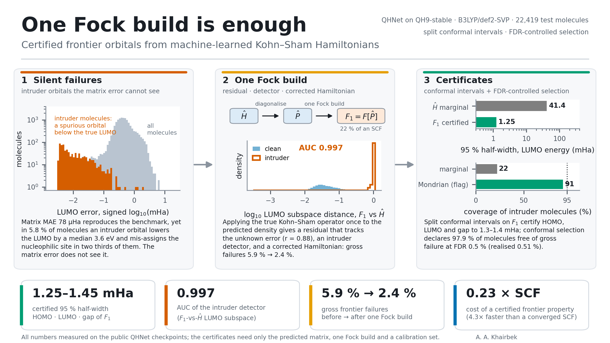

# ConformalOrb

**One Fock build is enough: certified frontier orbitals from machine-learned Kohn–Sham Hamiltonians.**

`ConformalOrb` turns a machine-learned Kohn–Sham Hamiltonian into something a chemist can act on: a per-molecule certificate for the HOMO, LUMO and gap with a known error rate, a test that catches qualitatively wrong (intruder) orbitals, and an FDR-controlled declaration "this prediction is free of gross failure". The only extra cost is **one Fock build** from the predicted density (22–25 % of a converged SCF).

Everything in the paper is produced by a single notebook that runs from an empty directory on the free Kaggle platform in about 10 hours, using the public [QH9](https://zenodo.org/records/8274793) benchmark and the released [QHNet](https://github.com/divelab/AIRS) checkpoints.



---

## What the paper shows

| Finding | id checkpoint (random split) | ood checkpoint (size split) |
|---|---|---|
| Hamiltonian MAE reproduces the published QHNet value | 77.6 µHa (published 76.31) | 73.5 µHa (published 72.11) |
| Share of the error in the virtual–virtual block (MO basis) | 99.3 % | 99.6 % |
| Davis–Kahan bound vacuous / Weyl bound useless | 100 % of molecules | 100 % of molecules |
| First-order perturbation theory, HOMO shift (relative error) | 11 % | 17 % |
| **Intruder molecules** (spurious orbital below the true LUMO) | 5.8 % | 3.3 % |
| Median LUMO error of intruder molecules | −131 mHa (−3.6 eV) | −37 mHa |
| Coverage of intruders by marginal 95 % intervals (LUMO) | 22 % | 16 % |
| One Fock build: intruder detector AUC (F₁-vs-Ĥ LUMO subspace) | 0.997 | 0.996 |
| Gross frontier failures, Ĥ → F₁ | 5.9 % → 2.4 % | 1.9 % → 0.4 % |
| 95 % half-width on F₁: HOMO / LUMO / gap (PT-normalised) | 1.25 / 1.25 / 1.45 mHa | 1.31 / 0.70 / 1.29 mHa |
| Coverage of intruders, Mondrian on the test-time flag (95 % nominal) | 91 % | 85–89 % |
| Conformal selection, declared sound at q = 0.5 % (realised FDP) | 97.9 % (0.51 %) | 100 % (0.39 %) |
| Cost of a certified frontier property (fraction of a default SCF) | 0.23 (4.3× faster) | 0.25 (4.0× faster) |

Two classes of intruder molecule matter for what one Fock build can do: **virtual-space** intruders (4.0 % / 2.8 %) are repaired by F₁ = F[P̂] (median LUMO error 70 → 0.7 mHa); **occupied-space** intruders (1.8 % / 0.5 %) are not, because the predicted density itself occupies a wrong orbital — but they produce a residual ‖F₁ − Ĥ‖ of about 3 Ha, a hundred times the normal value, and are flagged in 100 % of cases.

---

## The protocol in three steps

```
geometry ──QHNet──▶ Ĥ ──diagonalise──▶ P̂ ──one Fock build──▶ F₁ = F[P̂] ──compare with Ĥ──▶ test-time features
                                                                                           │
                       ┌───────────────────────────────┬───────────────────────────────────┤
                       ▼                               ▼                                   ▼
               intruder flag                  conformal selection                  conformal certificates
        F₁-vs-Ĥ frontier subspace          "no gross failure" with          95 % intervals on the HOMO, LUMO
        distance + residual norm            FDR ≤ q (clipped-score            and gap of F₁ (marginal,
        (98th percentile of clean           p-values of Jin & Candès,          PT-normalised, Mondrian on
        calibration molecules)              Benjamini–Hochberg)                the flag); else warm-started SCF
```

1. **Measure.** Diagonalise Ĥ, occupy the lowest orbitals, build F₁ = F[P̂] once (PySCF, `b3lyp5`/def2-SVP, density fitting, grid level 1). Record the residual ‖F₁ − Ĥ‖, the first-order shifts cᵢᵀ(F₁ − Ĥ)cᵢ, and the subspace distances between the frontier windows of F₁ and Ĥ.
2. **Calibrate.** On a few thousand molecules with converged Hamiltonians, compute split conformal quantiles (marginal / PT-normalised / Mondrian) and the conformal p-values of the "gross failure" null.
3. **Certify.** For a new molecule: flag, declare (BH at level q), and report the certified frontier energies of F₁ — or continue the SCF from P̂ (8 instead of 11 iterations, same converged state in 100 % of tested molecules).

The certificates are model-agnostic: they need only the predicted matrix, one Fock build and a calibration set.

---

## Quick start (Kaggle, no local installation)

1. Create a Kaggle notebook (CPU is enough for everything except stage 3, which uses a T4).
2. Upload `ConformalOrb.ipynb` and run all cells. The notebook writes the pipeline modules (`co_*.py`) to the working directory, downloads QH9-stable from Zenodo (30 GB, resumable), reconstructs the official splits, and runs stages 0–7 below. Each stage is skipped when its artifacts already exist in the working directory or in an attached input, so the run can be spread over several 12-hour sessions.
3. Outputs appear under `ConformalOrb/` (see **Outputs**). A cell at the end zips every CSV/PNG artifact for download.

Wall time of the reference run (4 CPU cores + one T4): download 21 min · subset 1 min · survey 16 min · inference 90 min · Fock features 397 min · SCF cost 67 min · Fukui 5 min ≈ 10 h.

### Local run

```bash
git clone https://github.com/alikhairbek/ConformalOrb.git
cd ConformalOrb
pip install -r requirements.txt          # pyscf, torch, e3nn, numpy, scipy, pandas, scikit-learn, matplotlib
jupyter notebook ConformalOrb.ipynb
```

Set `DATA_SOURCE = "synthetic"` in the configuration cell to exercise the whole pipeline on eight small molecules computed on the fly (minutes, no download) before committing to the 30 GB benchmark.

---

## Pipeline stages and modules

| Stage | Module | What it does | Main artifact |
|---|---|---|---|
| 0 | `co_acquire.py` | Resumable, parallel download of the QH9-stable Zenodo deposit (4-part zip, cross-part extraction without re-assembly) or streaming mode for small disks | `QH9Stable.db` |
| 1 | `co_subset.py` | Reproduces the official id (RandomState(43), 80/10/10) and ood (N ≤ 20 / 21–22 / ≥ 23 atoms) splits; extracts the two test sets (21,496 distinct molecules, 923 shared) into a 2.9 GB database with a `membership` table | `ConformalOrb_subset.db` |
| 2 | `co_phase0.py`, `co_survey.py` | Gauge-invariance tests of the subspace distance s_B (sign flips, rotations inside degenerate blocks, permutations); Weyl/Davis–Kahan under controlled perturbations; survey of 20,000 molecules (overlap conditioning, degeneracy, admissible perturbations); fresh-SCF check of the functional definition | `phase0_*.csv`, `qh9_survey.csv` |
| 3 | `co_infer.py` | QHNet inference with the released checkpoints (pure-torch shims for `torch_cluster`/`torch_scatter`, e3nn → PySCF AO-order map, vectorised matrix assembly checked against the official one); frontier diagnostics for every prediction | `phase1b_errors.csv`, `ConformalOrb_pred.db` |
| 4 | `co_fock.py` | One Fock build from the predicted density; residual, first-order estimates, F₁-vs-Ĥ subspace distances (with reference errors of F₁ for evaluation) | `phase2_features.csv` |
| 5 | `co_conformal.py` | Split conformal certificates (marginal / PT-normalised / Mondrian by flag or gap quartile), conformal selection with clipped-score p-values and Benjamini–Hochberg, three-way routing; 20 random calibration/evaluation splits | `phase2_summary.csv` |
| 6 | `co_phase3.py` | SCF cost protocol: converged SCF from the default guess, from P̂ and from the density of F₁ on 100 molecules per checkpoint | `phase3_scf_cost.csv`, `ConformalOrb_F1_sample.db` |
| 7 | `co_phase3.py` | Condensed frontier-orbital Fukui indices (f⁻, f⁺, dual descriptor) and tolerance-aware site agreement for all predictions | `phase3_fukui.csv` |

---

## Repository layout

```
ConformalOrb/
├── ConformalOrb.ipynb   # the single end-to-end notebook (stages 0–7)
├── src/                                     # the modules the notebook writes (kept here for reading/importing)
│   ├── co_acquire.py  co_subset.py  co_phase0.py  co_survey.py
│   ├── co_infer.py    co_fock.py    co_conformal.py  co_phase3.py
├── results/                                 # per-molecule result tables of the reference run (CSV)
│   ├── phase0/  phase0_gauge.csv  phase0_davis_kahan.csv  phase0_summary.csv
│   ├── qh9_survey.csv
│   ├── phase1b_errors.csv                   # 22,419 evaluations × 77 columns
│   ├── phase2/  phase2_features.csv  phase2_summary.csv
│   └── phase3/  phase3_scf_cost.csv  phase3_fukui.csv
├── manuscript/                              # figure and table generation for the paper
│   ├── compute_numbers.py  extra_numbers.py # every number in the paper → numbers.json
│   ├── make_figures.py                      # Figs 1–6, S1–S4 (Wong palette, PNG + PDF, 300 dpi)
│   ├── make_graphical_abstract.py
│   └── numbers.json
├── docs/graphical_abstract.png
├── requirements.txt
├── CITATION.cff
└── LICENSE
```

---

## Outputs

* **`phase1b_errors.csv`** — one row per (molecule, checkpoint): Hamiltonian MAE and spectral norms in the AO and orthogonalised bases, frontier energies and errors (`d_homo`, `d_lumo`, `d_gap`), subspace distances and Davis–Kahan quantities for the HOMO, LUMO, pair and four-orbital windows (`*_s_B`, `*_sin_theta`, `*_delta`, `*_dk_bound`), MO-basis error blocks (`D_ff`, `D_oo`, `D_vv`, `D_ov`, `D_vv_frac`), perturbative estimates (`homo_pt1`, `homo_pt2`, `homo_sin_pt`, …) and the test-time spectral quantities of the prediction (`gap_hat`, `homo_split_hat`, `lumo_split_hat`).
* **`phase2_features.csv`** — the one-Fock-build features: `f1_res_fro`, `f1_res_max`, `f1_res_occ`, `f1_res_frontier`, `f1_grad`, `f1_pt1_homo`, `f1_pt1_lumo`, `f1_dhomo`, `f1_dlumo`, `f1_gap`, `f1_sB_homo`, `f1_sB_lumo`, the build time `t_fock_s`, and (for evaluation only) the reference errors of F₁ (`ref_dhomo_F1`, `ref_dlumo_F1`, `ref_res_true`).
* **`phase2_summary.csv`** — coverage and half-widths of every certificate variant at 90 % and 95 %, and the selection statistics (selected fraction, realised FDP, power) at q = 0.2–5 %, for spectral-only and one-Fock-build features and for Ĥ and F₁.
* **`phase3_scf_cost.csv`** — iterations, wall times and converged energies from the default guess, from P̂ and from P(F₁), with the same-state flags.
* **`phase3_fukui.csv`** — Spearman correlation, strict and tolerance-aware top-site agreement, rank of the true top site and number of near-tied sites for f⁻, f⁺ and the dual descriptor (and for F₁ on the 200 timed molecules).

Intruder molecules are defined from `phase1b_errors.csv` as `lumo_s_B > 0.7 or homo_s_B > 0.7` (the latter is the occupied-space class).

---

## Certify your own Hamiltonian model

The certificate layer does not depend on QHNet. For any model that returns a Kohn–Sham matrix `H_hat` in the PySCF AO order of a `def2-SVP` (or any other) basis:

```python
from co_fock import fock_features          # one Fock build → test-time features
from co_conformal import run_conformal     # certificates + FDR-controlled selection

# 1. per molecule: one Fock build from the predicted density
feat = fock_features(Z, pos, H_hat, grid_level=1, use_df=True)     # dict of f1_* features

# 2. on a calibration table (one row per molecule with reference errors and the f1_* columns):
R = run_conformal(calibration_df, alphas=(0.1, 0.05), R=20, seed=0, fock=True,
                  tau={"eps_HOMO": 2e-3, "eps_LUMO": 5e-3, "gap": 5e-3, "sB_HOMO": 0.1, "sB_LUMO": 0.2},
                  tau_gross={"eps_HOMO": 1e-2, "eps_LUMO": 2e-2, "gap": 2e-2, "sB_HOMO": 0.7, "sB_LUMO": 0.7},
                  fdr_levels=(0.002, 0.005, 0.01, 0.02, 0.05), q_route=0.005)
```

`R["res"]` holds the coverage and half-widths per target and variant, `R["fdr"]` / `R["fdr_F1"]` the selection statistics, and `R["routing"]` the three-way routing. Recalibrate whenever the model, the basis set or the chemical space changes; exchangeability between calibration and test molecules is the only assumption behind the guarantees.

---

## Two things worth knowing before you reproduce anything

* **Functional definition.** QH9 was generated with PySCF 2.2.1, whose `b3lyp` uses VWN5 correlation. In PySCF ≥ 2.3 the same name denotes the VWN-RPA variant and produces a uniform 3.6 mHa offset against the stored matrices. Every Fock build and SCF in this repository uses `xc = "b3lyp5"`; a fresh tightly converged SCF then reproduces the stored orbital energies to 6 × 10⁻⁷ Ha.
* **Orbital comparisons.** Never compare orbitals with the naive overlap |⟨ψ|ψ̂⟩|: it is undefined under degeneracy (a rotation inside the degenerate HOMO pair of benzene drives it anywhere between 0 and 1). The subspace distance `s_B` on a degeneracy-aware window is gauge-invariant to 6 × 10⁻⁸ and is what every flag and certificate here is built on.

---

## Data and checkpoints

* QH9-stable: Yu et al., *NeurIPS Datasets and Benchmarks* 2023 — Zenodo record [8274793](https://zenodo.org/records/8274793) (`QH9Stable.db`, 30.47 GB, 130,831 molecules).
* QHNet checkpoints `QHNet-QH9-stable-id.pt` and `QHNet-QH9-stable-ood.pt`: released with the [AIRS](https://github.com/divelab/AIRS) repository (Google Drive links in their README). The notebook downloads them automatically; place them in the working directory if the download is blocked.

No data or checkpoints are redistributed here; the `results/` tables are derived quantities only.

---

## Citation

A preprint is in preparation. Until it appears, please cite the repository:

```bibtex
@software{khairbek2026ConformalOrb,
  author  = {Khairbek, Ali A.},
  title   = {ConformalOrb: certified frontier orbitals from machine-learned Kohn--Sham Hamiltonians},
  year    = {2026},
  url     = {https://github.com/alikhairbek/ConformalOrb}
}
```

## License

MIT. The QH9 data and the QHNet checkpoints keep the licences of their authors.

## Acknowledgements

The QH9 and QHNet authors, for releasing the data and checkpoints that made this study possible; Kaggle, for the compute on which the reference run was executed.
